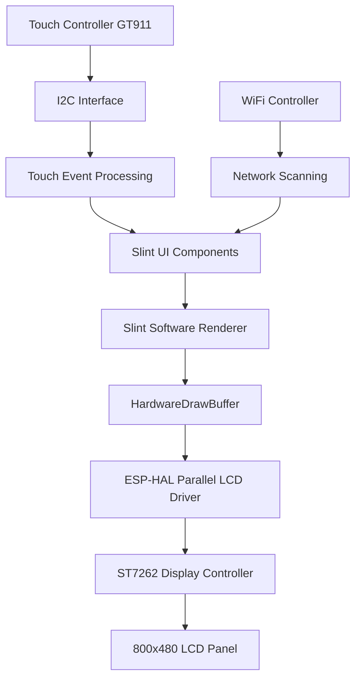

# Design Document: ST7262 Display Adaptation

## Overview

This design adapts the existing ESP32-S3-Box-3 Slint GUI application to work with an 800x480 ST7262 display using parallel interface. **The core principle is to change as few things as possible** - keeping the same application structure, Slint UI, WiFi functionality, and touch handling patterns.

**Minimal Changes Required:**
- Replace only the display driver initialization in `display.rs`
- Update display constants (resolution and buffer size) in `main.rs`
- Change GPIO pin assignments for parallel interface
- Update touch I2C pins to match new hardware
- Keep everything else identical

**What Stays the Same:**
- All Slint UI components and logic
- WiFi scanning functionality and task structure
- Touch event handling patterns and Embassy async framework
- Memory management approach (PSRAM usage)
- Application architecture and component interfaces

## Architecture

The system maintains the same high-level architecture with three main components:

1. **Display Hardware Layer**: Handles low-level display initialization and pixel output
2. **Slint Platform Layer**: Provides the bridge between Slint renderer and hardware
3. **Application Layer**: Contains UI logic, WiFi scanning, and touch handling



## Components and Interfaces

### Minimal Display Driver Changes

**Current Implementation (keep interface identical):**
```rust
pub struct DisplayHardware {
    pub display: /* current type */,
    pub touch: Gt911Blocking<I2c<'static, esp_hal::Blocking>>,
    pub i2c: I2c<'static, esp_hal::Blocking>,
}
```

**Strategy: Replace only the display field type, keep all method signatures identical**

**Key Interface Preservation:**
- Keep `HardwareDrawBuffer` struct and implementation pattern
- Maintain `LineBufferProvider` trait implementation
- Preserve `DISPLAY_COMPONENTS` global access pattern
- Keep `init_display_hardware()` function signature (just change pin parameters)

### Pin Configuration Changes (Only What's Necessary)

**Replace SPI pins with parallel pins in init function:**
- Remove: SPI2, GPIO4 (DC), GPIO5 (CS), GPIO6 (MOSI), GPIO7 (SCK)
- Add: 16 data pins + 4 control pins as specified

**Touch pins (simple change):**
- Change I2C pins from GPIO8/GPIO18 to GPIO15/GPIO16
- Change I2C address from 0x14 to 0x5D

### Memory Management (Minimal Change)

**Only change buffer size constants:**
```rust
// Change these constants only:
const LCD_H_RES: u16 = 800;        // was 320
const LCD_V_RES: u16 = 480;        // was 240
const LCD_BUFFER_SIZE: usize = 800 * 480;  // was 320 * 240
```

**Keep everything else identical:**
- Same PSRAM allocation strategy
- Same Box allocation for pixel buffer
- Same memory management patterns

## Data Models

### Display Configuration Structure

```rust
pub struct ParallelDisplayConfig {
    pub resolution: (u16, u16),           // (800, 480)
    pub pixel_clock_hz: u32,              // 21_000_000
    pub hsync_polarity: bool,             // false (active low)
    pub vsync_polarity: bool,             // false (active low)
    pub pclk_idle_high: bool,             // true
    pub hsync_front_porch: u16,           // 8
    pub hsync_pulse_width: u16,           // 4
    pub hsync_back_porch: u16,            // 8
    pub vsync_front_porch: u16,           // 8
    pub vsync_pulse_width: u16,           // 4
    pub vsync_back_porch: u16,            // 8
}
```

### Touch Configuration Structure

```rust
pub struct TouchConfig {
    pub i2c_address: u8,                  // 0x5D
    pub resolution: (u16, u16),           // (800, 480)
    pub sda_pin: u8,                      // 15
    pub scl_pin: u8,                      // 16
}
```

## Correctness Properties

*A property is a characteristic or behavior that should hold true across all valid executions of a system-essentially, a formal statement about what the system should do. Properties serve as the bridge between human-readable specifications and machine-verifiable correctness guarantees.*

### Property Analysis and Selection

Based on the prework analysis, I'll focus on the most critical properties that validate core functionality while avoiding redundancy:

**Property 1: Pin Configuration Completeness**
*For any* display initialization, all 16 data pins (D0-D15) should be configured with their specified GPIO assignments and all control pins should be assigned to their designated GPIOs
**Validates: Requirements 2.1, 2.2, 2.3, 2.4, 2.5**

**Property 2: Touch Coordinate Mapping**
*For any* touch input coordinates, the mapped coordinates should fall within the 800x480 resolution bounds and maintain proportional scaling from the touch sensor range
**Validates: Requirements 3.3**

**Property 3: Display Buffer Consistency**
*For any* rendering operation, the display buffer should have exactly 800×480 pixels and be allocated in PSRAM memory space
**Validates: Requirements 4.1, 4.2**

**Property 4: Slint Rendering Compatibility**
*For any* Slint UI component, rendering operations should complete successfully with the new buffer size and produce valid pixel data
**Validates: Requirements 4.3, 5.1**

**Property 5: System Functionality Preservation**
*For any* system operation (WiFi scanning, touch events, async tasks), the functionality should work identically to the original implementation
**Validates: Requirements 5.2, 5.3, 5.5**

## Error Handling

### Display Initialization Errors
- **GPIO Configuration Failures**: If any GPIO pin cannot be configured, return descriptive error indicating which pin failed
- **Parallel LCD Setup Failures**: If the parallel LCD interface cannot be initialized, provide error details about timing or hardware issues
- **Memory Allocation Failures**: If PSRAM buffer allocation fails, fall back to smaller buffer or return clear memory error

### Touch Controller Errors
- **I2C Communication Failures**: If touch controller cannot be reached at address 0x5D, log error but continue operation without touch
- **Coordinate Mapping Errors**: If touch coordinates are outside expected ranges, clamp to valid bounds rather than crashing

### Runtime Errors
- **Frame Rendering Failures**: If a frame cannot be rendered, skip the frame and continue with next frame rather than blocking
- **Buffer Overflow Protection**: Ensure all buffer operations are bounds-checked to prevent memory corruption

## Testing Strategy

### Unit Testing Approach
- **Pin Configuration Tests**: Verify each GPIO pin is assigned correctly during initialization
- **Buffer Size Tests**: Confirm display buffer has correct dimensions and memory allocation
- **Touch Mapping Tests**: Test coordinate transformation with known input/output pairs
- **Error Condition Tests**: Verify graceful handling of initialization failures

### Property-Based Testing Approach
- **Pin Assignment Property**: Generate random GPIO configurations and verify all required pins are properly assigned
- **Coordinate Mapping Property**: Generate random touch coordinates and verify they map correctly to display bounds
- **Buffer Operations Property**: Generate random pixel data and verify it fits within buffer bounds
- **Rendering Consistency Property**: Generate random UI states and verify consistent rendering behavior

### Integration Testing
- **End-to-End Display Test**: Verify complete pipeline from Slint rendering to display output
- **Touch Integration Test**: Verify touch events properly trigger UI responses
- **WiFi + Display Test**: Verify WiFi scanning updates display correctly
- **Memory Stress Test**: Verify system stability under continuous rendering load

**Testing Configuration:**
- Property tests: minimum 100 iterations per test
- Each property test tagged with: **Feature: st7262-display-adaptation, Property N: [property description]**
- Use existing Embassy async test framework
- Focus on hardware abstraction layer testing rather than low-level GPIO testing